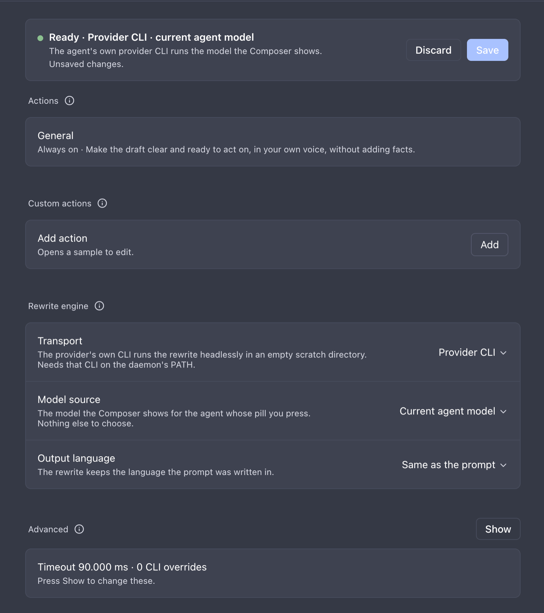
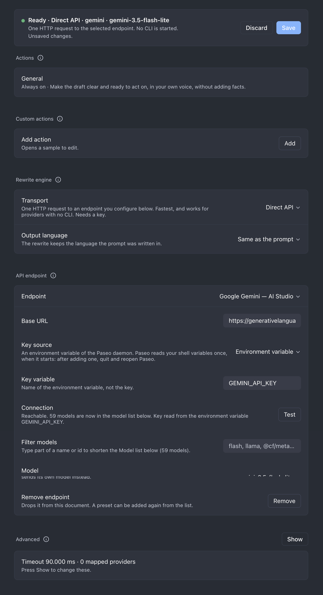

# PromptKit

PromptKit is a Paseo plugin that rewrites the prompt in your Composer before you send it. It adds a `PromptKit` pill to the Composer and a `/rewrite <prompt>` slash command. The rewrite replaces the Composer text in your own voice — first person, speaking to the agent — and keeps your language and every protected literal (URLs, absolute paths, shell commands, code blocks, model and tool names).

The rewrite runs one of three ways, chosen in Settings: the agent's own provider CLI with the model the Composer shows (the default), a provider CLI with a model you pick, or a direct request to an API you configure (OpenAI, Anthropic, Google Gemini, Cloudflare Workers AI, or anything speaking one of those protocols). A CLI runs headlessly in a temporary directory — no Paseo agent, no tab, no archive — so your conversation never receives a rewrite turn.

See [CHANGELOG.md](CHANGELOG.md) for release notes.

## Three ways to run it

- **The pill** — write your prompt, press `PromptKit`. The text is rewritten in place; a leading `/rewrite ` left in the text is ignored. Available once the agent exists, so on a new seat it appears after the first message.
- **`/rewrite <prompt>`** — type the command with the prompt after it and press Enter. Paseo empties the Composer and hands the text to PromptKit, which puts the `/rewrite …` line straight back, dims it with a light sweep while it works, and then replaces it with the rewrite. A failed rewrite leaves your line in place. Available immediately, including on a new seat before its first message. Because no agent exists yet on a draft, `/rewrite` cannot use `Current agent model`; choose `Dedicated model` or `Direct API` with a selected endpoint and model in Settings, or use the pill once the agent exists.
- **The PromptKit sheet** (mobile) — write in the Composer as usual and press the pill. A sheet slides up holding your text. With one enabled action it rewrites at once and **Rewrite** runs it again; with several, each action has its own button and nothing runs until you press one. **Send** gives the message to the agent, clears the Composer and closes the sheet. **✕** closes the sheet and leaves the Composer untouched.

No path sends the message on its own. You review the result and send it yourself.

## The General action

`General` is the one action that ships. It turns the draft into a clear instruction the agent can act on: the concrete action, each constraint made checkable, the working steps for that kind of task (find the cause first, follow the codebase's existing way, keep the change scoped), and how the agent knows it is done. It never invents files, numbers, requirements or decisions the draft does not contain, and it never writes about you as "the user". Add your own actions under Settings → **Custom actions**.

## Requirements

- Paseo `>=0.9.0` (Desktop, Web or mobile). Built and tested against the 0.9.0 plugin SDK.
- For **Provider CLI**: that provider's CLI on the daemon's `PATH`, and a model it can reach.
- For **Direct API**: an endpoint URL, a model id, and a key — see [API keys](#api-keys).

## Install from npm (recommended)

PromptKit is published on npm as [`paseo-prompt-kit`](https://www.npmjs.com/package/paseo-prompt-kit). On Paseo 0.9:

```bash
paseo plugin add npm:paseo-prompt-kit
paseo plugin ls
```

Pin a release by adding its version, for example `npm:paseo-prompt-kit@0.5.4`. The plugin id stays `prompt-kit`, so reload and logs use that id:

```bash
paseo plugin reload prompt-kit
paseo plugin logs prompt-kit
```

## Install from a local directory

```bash
cd /path/to/paseo-prompt-kit
npm install
npm run typecheck
paseo plugin install /path/to/paseo-prompt-kit
paseo plugin ls
```

`paseo plugin install` trusts the plugin: server code runs unsandboxed on the daemon host and client code runs inside Paseo. Reload after a code change:

```bash
paseo plugin reload prompt-kit
paseo plugin logs prompt-kit
```

## Install from Git

Install a managed Git checkout:

```bash
paseo plugin install hungcuong9125/paseo-prompt-kit --ref main
paseo plugin ls
```

`--ref` chooses the initial branch, tag, or commit once; later `paseo plugin update prompt-kit` follows the remote's default HEAD. Pin a release instead of tracking `main` by giving `--ref` a tag:

```bash
paseo plugin install hungcuong9125/paseo-prompt-kit --ref v0.5.4
```

`paseo plugin ls` reports the installed commit.

## Settings

Open PromptKit's settings from Paseo Settings → Plugins → the `…` menu on `prompt-kit` → **Settings**. The bar at the top says whether a rewrite would run and over which path, names the reason when it would not, and holds **Save** / **Discard** once something has changed. Nothing is written until Save.



The screen reads top to bottom in setup order:

1. **Actions** — one switch per action, bundled or custom; up to 6 can be on. One enabled action makes the pill rewrite at once; two or more make it a menu (on mobile, one button per action in the sheet); none hides the pill. A lone action shows as **Always on**, with no switch. Saving updates every pill at once.
2. **Custom actions** — your own actions, written as action-pack JSON in a text box on the same screen. **Add** opens a sample (Blank template, Copy of General, Execution brief, Plan first, Review request, Make concise, or a copy of one of yours); change the id, title and instructions, press **Apply** to check the JSON, then **Save**. They run through the same rewrite as `General`.
3. **Rewrite engine** — Transport, Model source (Provider CLI only) and Output language. Every other section appears only when these need it.
4. **Dedicated model** (Provider CLI with Dedicated model) or **API endpoint** (Direct API).
5. **Advanced** (collapsed) — timeout and the two per-provider overrides.

### Transport

- `Provider CLI` (default) — the provider's own CLI runs the rewrite headlessly. The model comes from **Model source**.
- `Direct API` — PromptKit posts to an endpoint you configure. No CLI is started, and there is no Model source: the model is chosen in the **API endpoint** section.

### Model source (Provider CLI only)

- `Current agent model` — the model the Composer's model control is showing for the agent whose pill you pressed. PromptKit reads the same value Paseo does (the provider session's runtime model first, then the configured model), so what you see is what runs.
- `Dedicated model` — a provider, model and thinking option you pick from the daemon's provider catalog, whatever the agent itself runs.

### Output language

`Same as the prompt` (default) keeps the language you wrote in. `English`, `Tiếng Việt`, or any language you add translates the prose while paths, commands, code and names stay exactly as written. A language is one JSON file under `shared/languages/`; see `docs/guides/output-languages.md`.

### The three paths

| Transport | Model source | What runs |
|---|---|---|
| `Provider CLI` | `Current agent model` | The agent's own provider CLI with the model the Composer shows |
| `Provider CLI` | `Dedicated model` | The dedicated provider's CLI with the model you picked |
| `Direct API` | — | An HTTP request to the endpoint and model chosen under **API endpoint** |

On `Direct API`, an agent whose provider is mapped under **Advanced → Endpoint per provider** sends its own model to that endpoint instead — this is how you point a provider such as `opencode` at your own OpenAI-compatible endpoint. Every other agent uses the endpoint and model from the **API endpoint** section; with no endpoint selected, only mapped providers can rewrite.

### API endpoint

Choose an endpoint — presets and your saved custom endpoints are listed A–Z (Anthropic, Cloudflare Workers AI, Google Gemini, Local server, OpenAI, OpenRouter), with **Custom endpoint…** last — fill in the base URL, pick a **Key source** (see [API keys](#api-keys)), and press **Test**. A successful test fills the **Model** list from the endpoint; the rewrite refuses a model outside that list. When a list has more than 8 models, a **Filter models** row above Model narrows the dropdown by name or id; the saved model always stays in it. Save is blocked while the endpoint cannot work (for example an empty base URL), with the reason in the status bar.



### Advanced

- `Timeout (ms)`: how long a rewrite may run, default `90000`, allowed range `1000`–`600000`. The daemon caps one plugin call at 30 s, so the screen notes when a budget above that cannot be reached.
- `CLI per provider` (Provider CLI): lists only the providers you have overridden, plus an Add row. A provider named after its CLI (for example `pi` or `codex`) resolves on its own and needs no entry; an unresolved provider is refused, never guessed.
- `Endpoint per provider` (Direct API): lists only mapped providers, plus an Add row. Pressing the pill in an agent of a mapped provider sends that agent's own model to the endpoint over HTTP. A mapped provider ignores the Model chosen under API endpoint.

Settings are host-scoped and persist across plugin reload.

## API keys

An API key is **never** stored in PromptKit's settings document. That document is read by the client — including the Paseo Web UI — so a key placed there would leave your machine. Instead each endpoint picks one **Key source** in the API endpoint section, and the daemon reads the value at request time from that source only. There is no fallback: a key missing from the chosen source fails closed with `missing_api_key`, the message names the variable and the place it looked, and the Composer text is untouched.

| Key source | Rows shown | Where the value is read |
|---|---|---|
| `Environment variable` (default) | Key variable | The daemon's environment variable with that name. The plugin server inherits the daemon's environment, so this suits a daemon started from a shell. |
| `secrets.json` | Key variable, Secrets directory, API key (optional); Cloudflare also Account ID | The entry with that name under `apiKeys` in `<Secrets directory>/secrets.json`. |
| `No key` | — | Nothing. For a local server (vLLM, llama.cpp, LM Studio). |

**Secrets directory** is shared by every endpoint that uses `secrets.json`. It must be an absolute path or start with `~/`. Empty means `<PASEO_HOME>/plugin-settings/prompt-kit`; `PASEO_HOME` defaults to `~/.paseo`, so on macOS the default file is `~/.paseo/plugin-settings/prompt-kit/secrets.json`.

After a successful **Test**, the Connection row says which source the key came from.

### Why the file exists at all

Paseo Desktop reads your login shell's environment **once, when it starts**, and the daemon keeps that copy. A key exported in `~/.zshrc` after Paseo started does not reach it until you quit and reopen Paseo; a daemon started some other way (a service, a remote host) may never see it. `secrets.json` is read at request time, so it works however and whenever the daemon was started.

### `secrets.json` format

One file holds every key: one entry per key under `apiKeys`, named whatever you like. Each endpoint whose Key source is `secrets.json` points at one entry through its **Key variable**, so several endpoints — or two accounts of one vendor, e.g. `GEMINI_WORK` and `GEMINI_PERSONAL` — share the file. Values must be strings; any other value is ignored.

```json
{
  "version": 1,
  "apiKeys": {
    "OPENAI_API_KEY": "sk-...",
    "ANTHROPIC_API_KEY": "sk-ant-...",
    "GEMINI_API_KEY": "AIza..."
  }
}
```

Start from the template in this repository and keep it owner-only:

```bash
mkdir -p ~/.paseo/plugin-settings/prompt-kit
chmod 700 ~/.paseo/plugin-settings/prompt-kit
cp docs/templates/secrets.template.json ~/.paseo/plugin-settings/prompt-kit/secrets.json
chmod 600 ~/.paseo/plugin-settings/prompt-kit/secrets.json
```

Then replace each `replace_me`, delete the entries you do not use, and set the matching endpoints' Key source to `secrets.json`.

### Storing a key from Settings (convenience, least preferred)

> [!WARNING]
> Typing a key into the **API key** field sends the secret from the Paseo app to the daemon once, over the same connection Paseo uses. When you use Paseo Web or a client on another machine, the key crosses that link. Anyone who can open your Paseo settings can also overwrite or remove stored keys. Use this only on a machine and connection you trust.

Prefer, in this order:

1. **An environment variable** of the daemon (Key source `Environment variable`) — nothing leaves the daemon's machine and no file holds the key.
2. **Editing `secrets.json` yourself** on the daemon's machine, as above — the key never passes through the Paseo app.
3. **The API key field** — only when neither of the above is practical.

With Key source `secrets.json`, the API endpoint section shows an **API key** field (masked) and a **Store API key** row. **Save** writes the value under the endpoint's Key variable in `secrets.json`: other entries and fields are kept, the directory is created `0700` and the file written `0600` through a temporary file and a rename, and a malformed file is refused rather than overwritten. The field is cleared after saving. The key is write-only: the screen only says whether a value is stored, and **Remove stored API key** deletes that one entry. The value never enters the settings document, a log, or an RPC answer. Two clients saving at the same moment can overwrite each other's change.

### What PromptKit guarantees about keys

- The value is never written to the settings document, never returned by any RPC, and never written to a log or an error message. A failure names the **variable** (`The environment variable "GEMINI_API_KEY" is not set`), not the value.
- The key is read at request time and used for that one request only. It is not cached to disk.
- PromptKit writes `secrets.json` only when you press **Save** or **Remove** in the API key rows, and only the one entry named by the endpoint's Key variable. It never reads a value back to the app.
- An endpoint whose Key source is `No key` sends no credential. That is valid for a local server (vLLM, llama.cpp, LM Studio), which is why it is allowed rather than treated as an error.

### Endpoint configuration

Endpoints are defined in the settings document under `apiEndpoints`, because that is the only configuration store a Paseo plugin can read. A provider profile in `~/.paseo/config.json` is **not** visible to PromptKit: the daemon does not pass provider environment variables to plugins.

Each endpoint is one of four protocols. Adding a vendor that speaks one of them is a settings edit, not a code change:

| Protocol | Request | Works with |
|---|---|---|
| `openai` | `POST <baseUrl>/chat/completions`, `Authorization: Bearer` | OpenAI, OpenRouter, LiteLLM, vLLM, llama.cpp, LM Studio, Together, Fireworks, Groq, most gateways |
| `anthropic` | `POST <baseUrl>/v1/messages`, `x-api-key` | Anthropic, z.ai, Alibaba/Qwen, Anthropic-compatible gateways |
| `gemini` | `POST <baseUrl>/v1beta/models/<model>:generateContent`, `x-goog-api-key` | Google AI Studio, Vertex |
| `cloudflare` | `POST <baseUrl>/accounts/<account id>/ai/run/<model>`, `Authorization: Bearer` | Cloudflare Workers AI (`@cf/...` models) |

**Cloudflare Workers AI.** Base URL `https://api.cloudflare.com/client/v4`. The endpoint has an extra **Account ID** row, above Key variable, holding the **name** of the variable with your account id — prefilled `CLAUDFLARE_ACCOUNT_ID`, change it if yours differs. The account id is read from the same **Key source** as the token, so with `secrets.json` both live in the file and work however Paseo was started. The key variable defaults to `CLOUDFLARE_AUTH_TOKEN`, an API token with Workers AI permission. Models are the full `@cf/...` ids, for example `@cf/meta/llama-3.1-8b-instruct-fp8`; **Test** lists the account's text-generation models. PromptKit sends `max_tokens: 2048` because the service default of 256 tokens would cut a rewrite short.

Example — a Google Gemini endpoint with `gemini-2.5-flash-lite`, from the settings document:

```json
{
  "transport": "api",
  "apiEndpointId": "gemini",
  "apiModel": "gemini-2.5-flash-lite",
  "apiEndpoints": [
    {
      "id": "gemini",
      "label": "Google Gemini",
      "protocol": "gemini",
      "baseUrl": "https://generativelanguage.googleapis.com",
      "keySource": "env",
      "apiKeyEnv": "GEMINI_API_KEY",
      "models": ["gemini-2.5-flash-lite"]
    }
  ]
}
```

Example — point one provider at an endpoint, so it never pays a CLI cold start:

```json
{
  "transport": "api",
  "apiEndpointByProvider": { "opencode": "openrouter" }
}
```

An endpoint that lists `models` restricts the choice to that list, and a model outside it fails closed with `invalid_model` before any request. Leave `models` empty to accept any model id — correct for a local server whose list PromptKit cannot know.

### API failure codes

| Code | Meaning |
|---|---|
| `missing_api_key` | The endpoint's Key source has no value for its key variable, `secrets.json` is missing or malformed, or the secrets directory is not absolute |
| `api_endpoint_unknown` | The selected or mapped endpoint id is not defined in `apiEndpoints` |
| `invalid_model` | The model is not in the endpoint's `models` list |
| `api_http_error` | The endpoint answered a non-2xx status, or was unreachable |
| `api_bad_response` | The answer was not JSON, or carried no text |
| `timeout` | The request exceeded `Timeout (ms)` |

Every one of these leaves the Composer text untouched.

## Limitations

- In-place rewriting works on Desktop and Web only: the mobile app renders the Composer as a native text input with no DOM, and Paseo 0.9.0 exposes no plugin API for Composer text. On mobile the `PromptKit` pill opens the **PromptKit sheet** instead (see above); it reads and clears the Composer through the app's React tree rather than the DOM, which a Paseo update can break in the same way. Nothing is copied or sent on its own. `/rewrite` is not available on mobile. On Web, a refusal names what was found (no Composer, none visible, or more than one visible).
- Requires Paseo `>=0.9.0`. Because text access depends on the Composer DOM (or, on mobile, the React tree), a Paseo UI change can break it even when the public plugin SDK is compatible.
- PromptKit refuses to replace text you edited while a rewrite was running, and refuses when more than one Composer (or none) is visible.
- Only `General` ships. Any other action is a custom action you write in Settings, or a pack you bundle as a JSON file — see `docs/EXTENDING.md`.
- The API transport does not stream: it makes one request and waits for the whole answer. A slow endpoint can exceed the daemon's 30-second plugin-call cap, in which case the host reports a timeout before PromptKit's own `Timeout (ms)` can fire.
- No OAuth or token refresh: an endpoint uses a static key. A provider that needs an interactive login is better served by the CLI transport.

## Project layout

The host compiler accepts only `client/`, `server/` and `shared/` at the root, so the modules live inside them. `docs/CORE.md` names each module's one responsibility; `docs/guides/` walks through the two data-only extensions (a new action pack, a new output language); `docs/EXTENDING.md` covers those plus API protocols, CLI families and settings sections, with templates under `docs/templates/`.

## License

MIT — see `LICENSE`. PromptKit contains no copied upstream code. The Composer text access pattern follows [paseo-emoji](https://github.com/YoseptF/paseo-emoji) (MIT); the plugin runs on [Paseo](https://github.com/getpaseo/paseo) (Apache-2.0) through its public plugin SDK.
</content>
